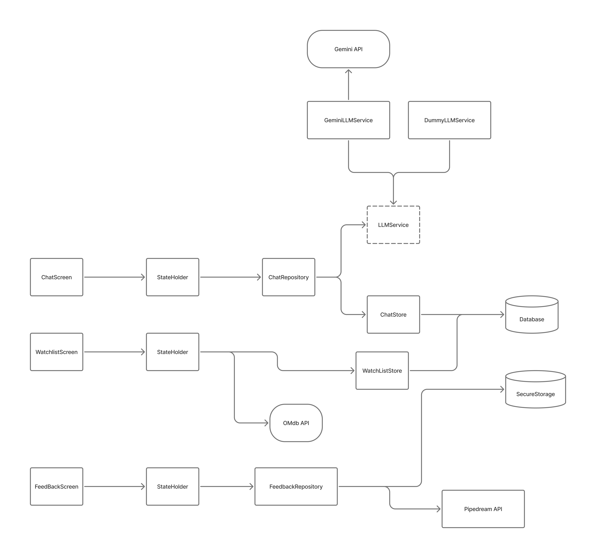
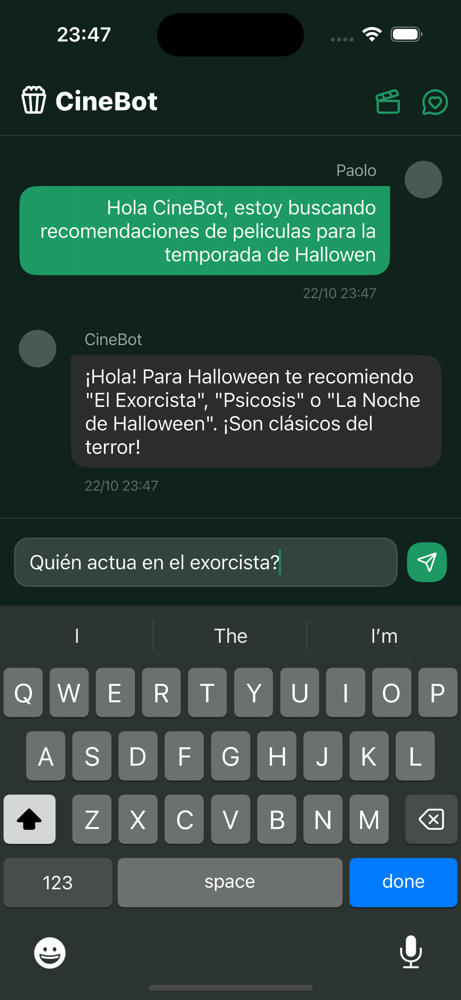
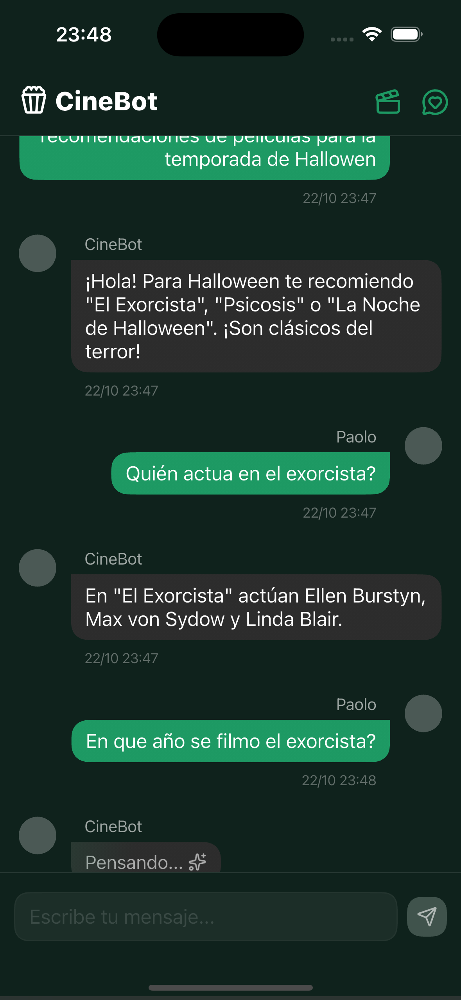
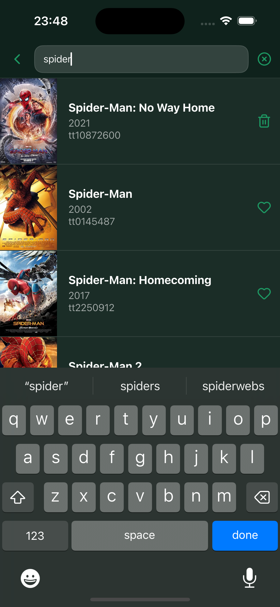
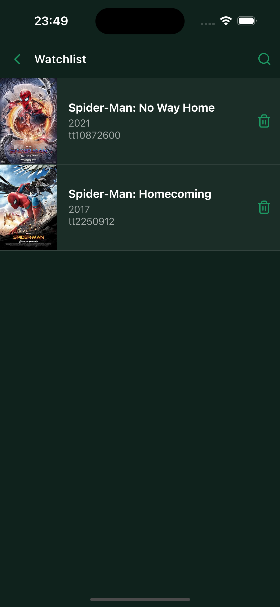
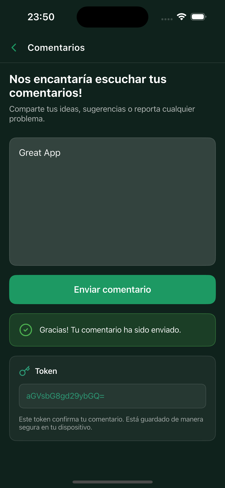

# 🎬 Movie Chat

Una aplicación Flutter para conversar sobre películas con inteligencia artificial, gestionar tu lista de películas favoritas y proporcionar feedback sobre la experiencia.

Para facilitar el acceso a la aplicación [aquí puedes encontrar un APK precompilado](https://drive.google.com/file/d/1wThLfUyQJLZuBBIPPMMZoEzD_AXtQlSC/view?usp=sharing)

## 📋 Características

- **💬 Chat con IA**: Conversa sobre películas con Gemini AI
- **🎥 Lista de Películas**: Gestiona tu watchlist personal con información de OMDb
- **📝 Feedback**: Sistema de retroalimentación para mejorar la experiencia

## 🏗️ Arquitectura

El proyecto sigue una arquitectura limpia y modular con separación de responsabilidades:



### Componentes Principales

- **UI Layer**: Pantallas (ChatScreen, WatchlistScreen, FeedbackScreen)
- **State Management**: con Provider y Flutter Hooks
- **Repository Pattern**: Para manejo de lógica de negocio
- **Store Layer**: Para persistencia de datos
- **Services**: Integración con APIs externas (Gemini, OMDb, Pipedream)

## 📁 Estructura del Proyecto

El proyecto sigue una estructura "feature-first" donde cada feature es un modulo autocontenido.
La estructura de directorios luce de esta manera:

```
lib/
├── features/
│   ├── chat/
│   ├── feedback/
│   ├── llm/
│   └── watchlist/
├── router/
│   ├── router.dart
│   └── screens/
├── service_locator.dart
└── main.dart
```

## 🛠️ Tecnologías

### Framework y Lenguaje

- **Flutter** (SDK 3.9.0+)

### Dependencias Principales

- `sembast` - Base de datos NoSQL local
- `flutter_secure_storage`- Almacenamiento seguro
- `get_it` - Inyección de dependencias
- `http` - Cliente HTTP
- `flutter_don_env` - Manejo de variables de entorno

### APIs Externas

- **Gemini API** - Se obtienen respuestas a los mensajes del usuario
- **OMDb API** - Utilizamos OMDb para poder hacer busqueda de peliculas que el usuario puede agregar a su watchlist
- **Pipedream API** - Simulación de un endpoint POST que regresa un "token" que guardamos de manera segura.

## 🚀 Instalación

### Prerrequisitos

- Instalación valida de Flutter (versión 3.9.0 o superior)
- API Keys para:
  - Google Gemini AI
  - OMDb

### Pasos

1. **Clonar el repositorio**

```bash
git clone git@github.com:paolovalerdi/movie_chat.git
cd movie_chat
```

2. **Instalar dependencias**

```bash
flutter pub get
```

3. **Configurar API Keys**

Crea un archivo `.env` en la raíz del proyecto y agrega tus API Keys

```
GEMINI_API_KEY=<YOUR_API_KEY>
OMDB_API_KEY=<YOUR_API_KEY>
```

4. **Ejecutar la aplicación**

```bash
flutter run
```

## 🏞️ Screenshots

| Chat                              | Chat                                   |
| --------------------------------- | -------------------------------------- |
|  |  |

| Watchlist                              | Watchlist                                   |
| -------------------------------------- | ------------------------------------------- |
|  |  |

| Feedback                                      |     |
| --------------------------------------------- | --- |
|  |     |
